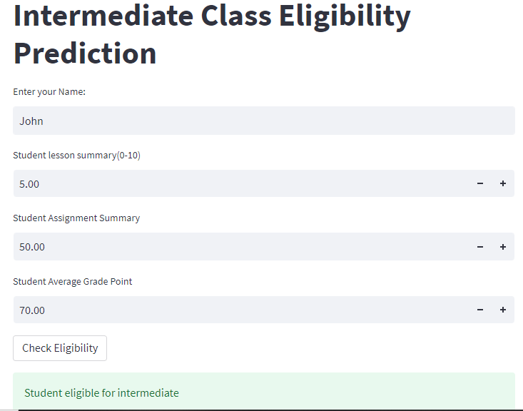

# Student Intermediate Class Eligibility Prediction App

## Introduction
In order to predict whether a student would be promoted to the intermediate class based on their performance, I built a Machine learning classification model using Logistic Regression. The model was deployed on Streamlit app.

## Aims and Objectives
- To predict students' eligibilty for the intermediate class.
- To check for the varible that best contributed to the achievement of the target variable
- To check the model that best predict the terget variable.

## Tools
The tools used in this project includes python libraries like:
- Pandas
- Numpy
- Seaborn
- Matplotlib
- Sklearn
- pickle
- Streamlit

## Student Eligibilty Prediction App

